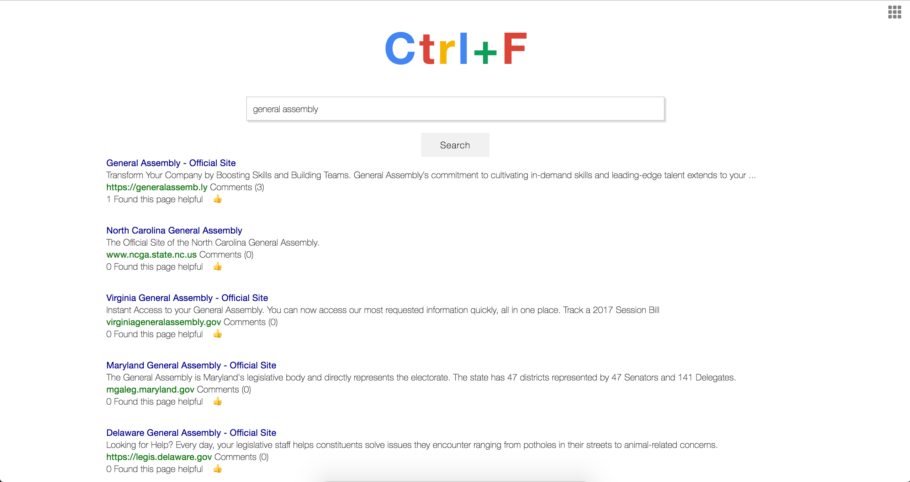

#Project 03: Ctrl + F
---
**Ctrl + F** is a web search-engine application that links to the results with user's feedback on the content. 

<!--More prodcut introduction?-->

--
###Installation
Following is the link to Ctrl+F:
[Ctrl+f Heroku URL](https://arcane-hollows-97544.herokuapp.com/)

--
###Preview

--
###Development & Technologies

This application is built using Node.js with express, mongoDB, jQuery/Javascript, AJAX, CSS/Bootstrap, milligram, HTML. 3rd party API used is "Bing".

--
###Project Procedure
- Product Decision: Our team reached a consesus based on anaylizing what users primarily use search engines for. We wanted to develop a search engine where one can both search and add data to the result.
- Work distribution: After scoping out the project, work was distriubted based on the final merge point, which was the search result render with our application data appended. 
- Communication: Combination of individual work and paired-programming required our team to communicate frequently and think in parallel to each other.
- Polish & Publish: With the MVP accomplishment, we added additional features and polished the interface for better user experience.

--
###MVP

Users are able to query/search for the results and also able to view/add comments on the page. Both the original result and added comments viewable in the same page.

--
###Project Organization
[Presentation Deck] () 

[User Stories List](https://onedrive.live.com/view.aspx?resid=9ED0BDE3A110F6D7!128&ithint=file%2cxlsx&app=Excel&authkey=!AI2UPK9WIDdOW7Y)

[ERD Model] (https://www.gliffy.com/go/share/sw4n2emwxlp16bybcxty)

[Trello Board] (https://trello.com/b/DaBpYK8g/project-03-ctrl-f)

--
###Unsovled Problems

- Retaining the original webpage's features as users proceed in the application.
- Speedy search problems

--
###Dream Features
- Chrome extension/plugin utility
- Attach comments to a specific part of the webpage
- Sorting results according to user's reactions
- Displaying/featuring contents curated by users
- Complex ctrl+F commands

