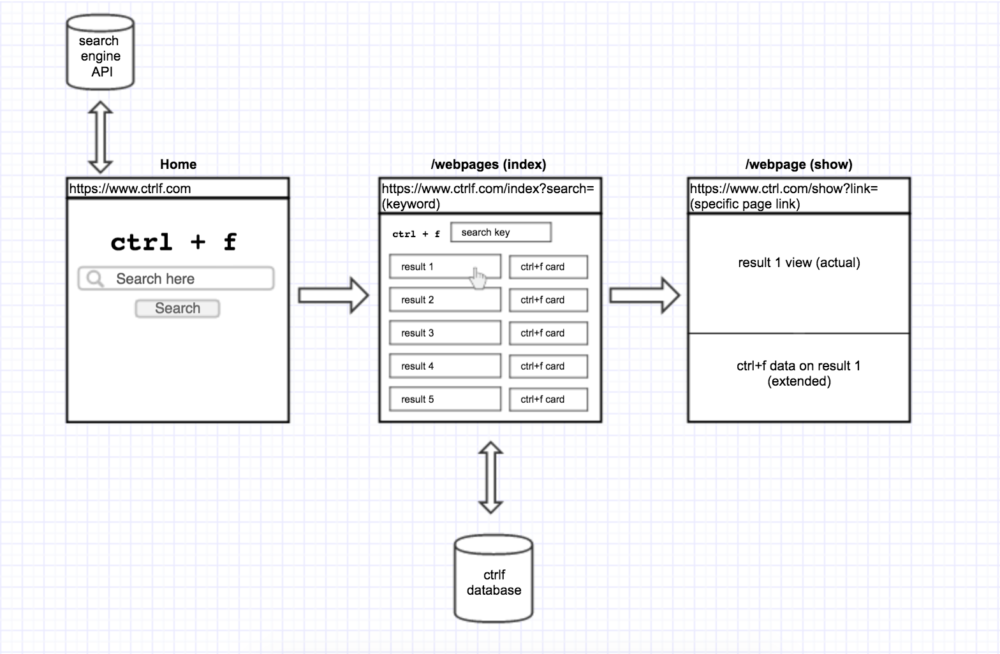

#Project 03: Ctrl + F
---
**Ctrl + F** is a search-engine web application that allows searching and linking of the specific page, along with user-generated/structured data (i.e. reviews, comments on the page or the content itself).

<!--Update as we proceed-->

--
###Installation

<!--Update when set-->

--
###Wireframe

<!--Substitute with our application preview-->

--
###Development & Technologies

This application is built using Node.js with express, jQuery/Javascript, AJAX, CSS/Bootstrap, HTML. 3rd party API utility is "Bing".

<!--Update as we proceed-->

--
###Project Procedure
<!--General approach taken-->

--
###MVP

Users are able to query/search for the results and also able to view/add comments on the page. Both the original result and added comments viewable in the same page.

--
###Project Organization
[Presentation Deck] () 

[User Stories List](https://onedrive.live.com/view.aspx?resid=9ED0BDE3A110F6D7!128&ithint=file%2cxlsx&app=Excel&authkey=!AI2UPK9WIDdOW7Y)

[ERD Model] (https://www.gliffy.com/go/share/sw4n2emwxlp16bybcxty)

[Trello Board] (https://trello.com/b/DaBpYK8g/project-03-ctrl-f)

--
###Unsovled Problems

<!--Update as we proceed-->

--
###Dream Features
Over Google...

<!--Update as we proceed-->

